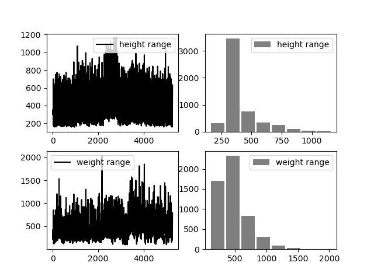

# Yolov3-custom-pedestrian-detection  

## 📝 Table of Contents
- [PennFudanAugmentation](#PennFudanAugmentation)
- [trainPennFudan](#trainPennFudan)
- [DetectionEffect](#DetectionEffect)

## PennFudanAugmentation
Darknet yolo: https://pjreddie.com/darknet/yolo/
 
Dataset: https://www.cis.upenn.edu/~jshi/ped_html/ 
 
The data set contains only 170 samples, so we argument the data set 
by scaling or cropping each image.
 
1)genImageBoxLabel: Convert the original annotation to yolov3 label format.
 
2)splitImageDataset: Split images and labels file to train and test set.
 
3)testLabel: Rectangle image from yolov3 labels format to validate the labels data.
 
4)main: Main function to argument the image set by scaling and cropping method.

 
Dataset description before augmentation(170 sample images).
 

 
Dataset description after augmentation(5270 sample images).
 

## trainPennFudan
Darknet config files for training.

## DetectionEffect 
 

